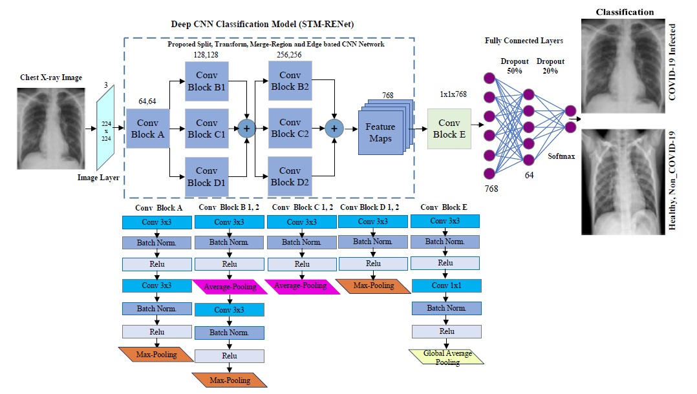
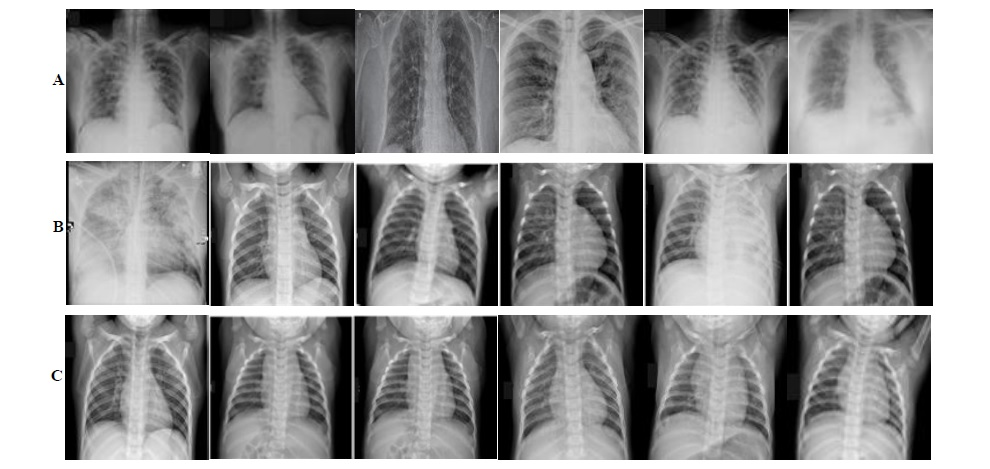
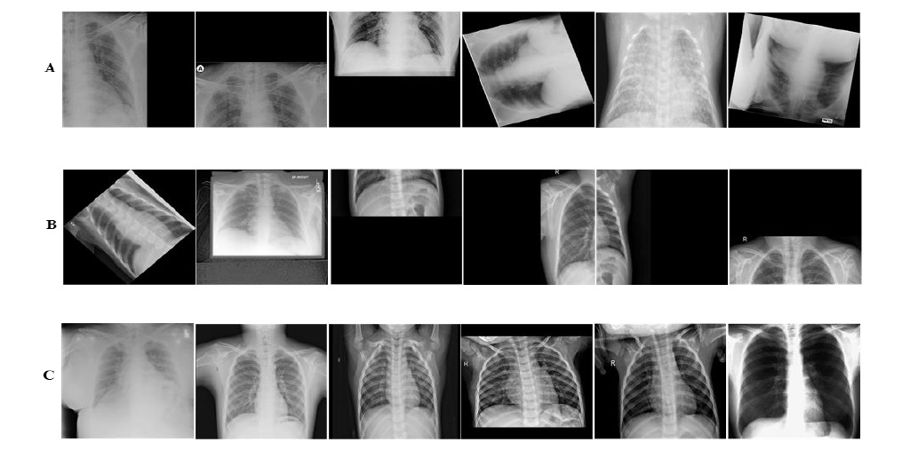
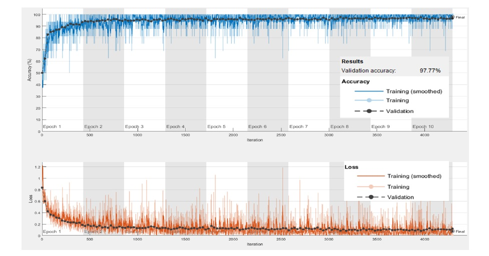
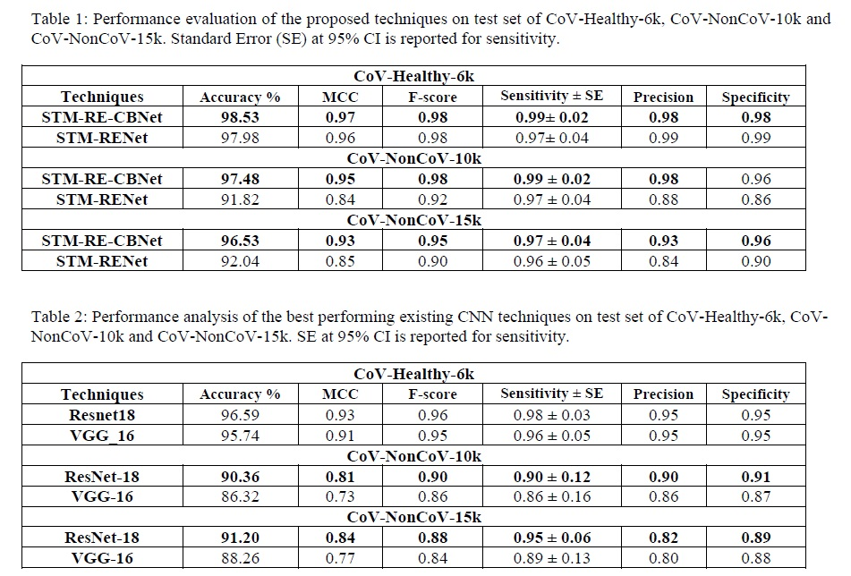

# COVID-19 Detection in Chest X-Ray Images using a New Channel Boosted CNN

COVID-19 is a highly contagious respiratory infection that has affected a large population across the world and continues with its devastating consequences. It is imperative to detect COVID-19 at the earliest to limit the span of infection. In this work, a new classification technique “CB-STM-RENet” based on deep Convolutional Neural Network (CNN) and Channel Boosting is developed for the detection of COVID-19 from chest X-Rays. In this connection, to learn the COVID-19 specific radiographic patterns, a new convolution block based on split-transform-merge (STM) is developed. This new block systematically incorporates region and edge base operations at each branch to capture the diverse set of features at various levels, especially those related to region homogeneity, textural variations, and boundaries of the infected region. We further enhanced the learning and discrimination capability of the proposed CNN architecture by exploiting the Channel Boosting idea that concatenates the auxiliary channels along with the original channels. The auxiliary channels are generated by employing Transfer Learning-based domain adaption of the pre-trained CNN architectures. The effectiveness of the proposed technique “CB-STM-RENet” is evaluated on three different datasets containing CoV-Healthy-6k, CoV-NonCoV-10k, and CoV-NonCoV-15k Chest X-Ray images, respectively. The performance comparison of the proposed deep CB-STM-RENet with the existing techniques exhibits high classification performance both in discriminating COVID-19 chest infections from healthy, as well as, other types of chest infections. CB-STM-RENet provides the highest performance on all these three datasets; especially on the stringent CoV-NonCoV-15k dataset. The good detection rate (97%), and high precision (93%) of the proposed technique suggest that it can be adapted for the diagnosis of COVID-19 infected patients.

In this repository, we provide the MATLAB GUI and Testing Code for the COVID-19 Detection in Chest X-Ray images for the research community to use our research work.

## Overview of the workflow for the proposed COVID-19 Detection Framework

This work proposes a new technique based on CB CNN for automated detection of COVID-19 from chest X-Ray images. The proposed technique targets the discrimination of COVID-19 infected from both non-COVID-19 infected and Healthy individual. In this regard, a new CNN classifier based on novel split-transform-merge (STM) block is developed that systematically implements RE-based operations for the learning of COVID-19 specific patterns and termed as “STM-RENet”. The learning capacity of the proposed CNN is enhanced using Channel Boosting to improve the detection rate while maintaining high precision. The CB CNN is termed as “CB-STM-RENet”. The performance of the proposed technique is compared with several existing CNNs by implementing them from scratch as well as by adapting them using TL on X-Ray dataset for COVID-19 detection. The overall workflow is shown in Figure 1.


## Models Architecture

### Architectural details of the proposed STM-RENet



### Architectural details of the proposed CB-STM-RENet


**Trained Model is available at [this](https://drive.google.com/drive/folders/14mjP2ZYgAE_eQUyA-9-kPMd49sb2Yoe7?usp=sharing) link.**

## Dataset

Three different Chest X-Ray images datasets were used.

1. CoV-Healthy-6k
2. CoV-NonCoV-10k
3. CoV-NonCoV-15k

**Dataset wil be available on request, contact at <hengrshkhan822@gmail.com>**

### Dataset Samples

Panel (A), (B), and (C) show COVID-19 infected, Non-COVID-19 infected, and Healthy images, respectively.



### Stringent CoV-NonCoV-15k Dataset

Panel (A), (B), and (C) show COVID-19 infected, Non-COVID-19 infected, and Healthy images, respectively. The images are tough to classify because of having high illumination, translational, rotational, occlusion and missing informational effects.



## Training plot of Proposed CB-STM-RENet

Training Plot of proposed CB-STM-RENet technique on CoV-NonCoV-15k dataset.



## Results



## Requirements

1. Matlab 2019b.
2. Deep Learning library.
3. NVIDIA GeForce GTX Titan X Computer.

## Setup

1. Clone this repo.

```git bash
git install https://github.com/PRLAB21/COVID-19-Detection-System-using-Chest-X-Ray-Images.git
```

2. Change directory to cloned folder.

```cmd
cd COVID-19-Detection-System-using-Chest-X-Ray-Images-master
```

3. Download model and place it in following structure.

```text
COVID-19-Detection-System-using-Chest-X-Ray-Images-master
|__proposed-CB-STM-RENet-model
   |__Proposed_CB_STM_RENet.mat
```

4. Testing images are downloaded along with this repo and are present inside COVID-X-ray-test-images directory.

5. Run code below mentioned methods.

## Inference Code

1. Open MATLAB.
2. Set MATLAB folder location same as this repos folder.
3. Now add each folder to MATLAB path from Current Folder panel by right clicking on each folder and selecting Add to Path > Selected Folder and Subfolders.
4. Now you can run either test models individually or run MATLAB GUI App as described below.

### Directory: classification-test-code

-   **test_code_image.m**: Use this file for testing classification model on folder of images at once.

### Directory: MATLAB-GUI-app

-   Inside this directory there is **gui_classification.mlapp** file. In order to use MATLAB-GUI-app type following at command window.

```MATLAB
>> gui_classification
```

Now the GUI interface will open after some time, then it will allow use to load image, and classify it as COVID-19 or Non-COVID-19.

## Co-Author

Prof. Asifullah Khan,

Department of Computer and Information Sciences (DCIS),

Pakistan Institute of Engineering and Applied Sciences (PIEAS).

Email: asif@pieas.edu.pk

faculty.pieas.edu.pk/asifullah/

## How to cite / More information

Khan, Saddam Hussain, Anabia Sohail, & Asifullah Khan. "COVID-19 Detection in Chest X-Ray Images using a New Channel Boosted CNN."
arXiv preprint: [2012.05073](https://arxiv.org/abs/2012.05073) (2020).

```Bibtex formatted citation
@misc{khan2020covid19,
      title={COVID-19 Detection in Chest X-Ray Images using a New Channel Boosted CNN},
      author={Saddam Hussain Khan and Anabia Sohail and Asifullah Khan},
      year={2020},
      eprint={2012.05073},
      archivePrefix={arXiv},
      primaryClass={eess.IV}
}
```
